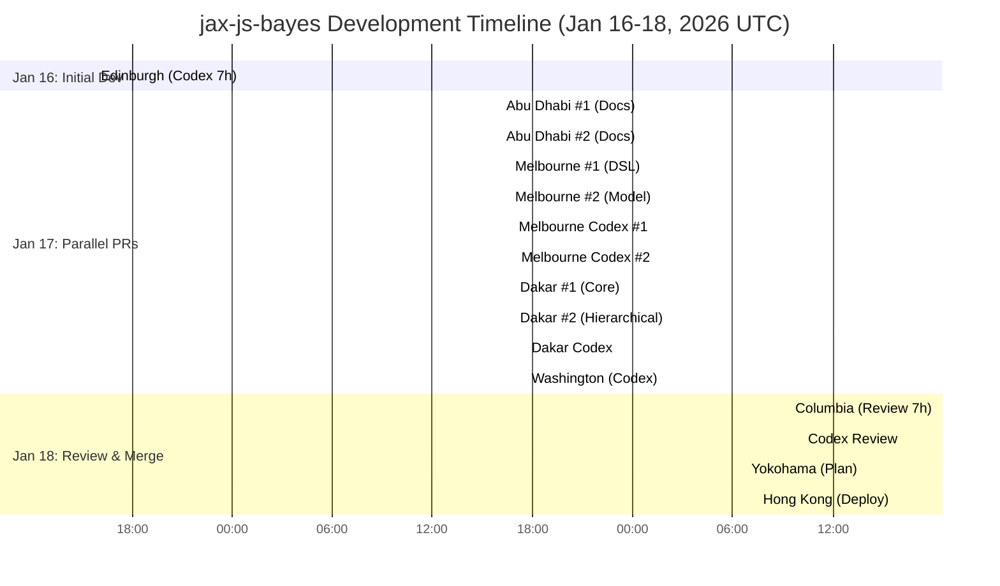
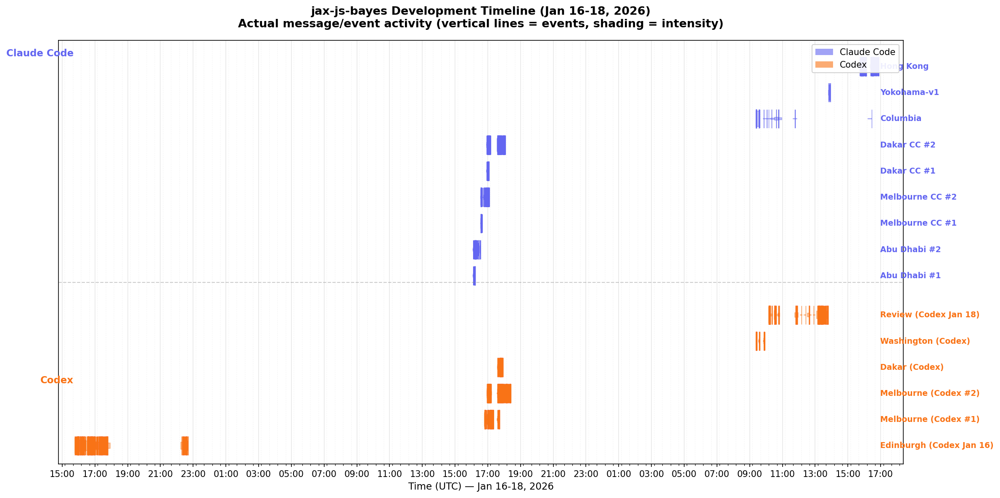

# jax-js-bayes Development Workflow (Jan 16-18, 2026)

Multi-agent development using Claude Code + Codex across 4 parallel worktrees.

---

## Overview

The library was developed through:
- **4 parallel implementation worktrees** creating competing PRs:
  - **Melbourne** (Claude Code) → PR #2
  - **Edinburgh** (Codex) → PR #3
  - **Dakar** (Claude Code) → PR #4
  - **Washington** (Codex) → PR #5 ✅ **MERGED**
- **Additional coordination worktrees** for review and merge:
  - Abu Dhabi (documentation)
  - Columbia (PR comparison)
  - Yokohama (merge plan)
  - Hong Kong (final deployment)
- **15 total sessions** (9 Claude Code + 6 Codex)

From concept to validated library with 11 posteriordb reference tests passing in ~48 hours of wall-clock time.

---

## Development Phases

### Phase 1: Parallel Library Implementation - Jan 16-17, 2026

Four independent worktrees implementing the library in parallel:

#### Edinburgh Worktree (Codex) → PR #3

**[Codex: Jan 16](https://gistpreview.github.io/?ecda8ba9ccfca3e4379cb78fbb831d33/index.html)** *(15:46-22:41 UTC, 7 hours)*
- 22 prompts, 5 pages, 2.8 MB session
- **Initial jax-js-bayes implementation**
- Distribution framework, model DSL, constraints
- Observable Plot visualization integration
- Move semantics alignment

#### Melbourne Worktree (Claude Code) → PR #2

**[Claude Code: Melbourne #1](https://gisthost.github.io/?e893e12f36e0af77c6403c2303ce7d8c/index.html)** *(16:34-16:39 UTC)*
- 1 prompt, 1 page, 19 MB session
- Model DSL design exploration

**[Claude Code: Melbourne #2](https://gisthost.github.io/?55d49916eb98bb628678c24e3aa2cbbf/index.html)** *(16:33-17:06 UTC)*
- 9 prompts, 2 pages, 20 MB session
- **Declarative Bayesian modeling library**
- Complete model compilation
- Type system (complete/predictive gating)

**[Codex: Jan 17 #1](https://gistpreview.github.io/?71554e2c534df5bb73d341762c6f14e8/index.html)** *(16:48-17:43 UTC)*
- 4 prompts, 1 page, 2.1 MB session
- Sampling and validation refinements

**[Codex: Jan 17 #2](https://gistpreview.github.io/?13755ad9724bb3c88aabb2674c12c4e4/index.html)** *(16:56-18:24 UTC)*
- 4 prompts, 1 page, 4.0 MB session
- Extended testing and fixes

#### Dakar Worktree (Claude Code) → PR #4

**[Claude Code: Dakar #1](https://gisthost.github.io/?13346c514c53f598f3cad1647d6ff275/index.html)** *(16:55-17:05 UTC)*
- 7 prompts, 2 pages, 23 MB session
- **Phase 1 & 2: Core DSL + posteriordb validation**
- Reference draw loading system
- Validation framework

**[Claude Code: Dakar #2](https://gisthost.github.io/?26579857815a43936ea2f596dc0c1a63/index.html)** *(16:54-18:04 UTC)*
- 13 prompts, 3 pages, 25 MB session
- **Phase 3-5: Hierarchical models**
- `samplePrior()` and `simulate()` methods
- Complete posteriordb test suite (11 models)

**[Codex: Jan 17 #3](https://gistpreview.github.io/?0e46738d336a15019d72fe7e867b034c/index.html)** *(17:35-17:55 UTC)*
- 7 prompts, 2 pages, 900 KB session
- Testing and refinements

#### Washington Worktree (Codex) → PR #5 ✅ **MERGED to main**

**[Codex: Jan 17 #4](https://gistpreview.github.io/?b84f6e9521b09b4f8fadc24d9847dfbc/index.html)** *(17:35-17:55 UTC, parallel with Dakar)*
- 1 prompt, 1 page, 2.0 MB session (likely initial)
- **Core library implementation**
- Merged Jan 18 at 16:24 UTC

---

### Phase 2: Review & Consolidation - Jan 17-18, 2026

After 4 competing implementations, consolidation and review:

#### Abu Dhabi Worktree (Documentation) → PR #1 **MERGED**

**[Claude Code: Abu Dhabi #1](https://gisthost.github.io/?76d9bd7b478902341ae83550e63171ec/index.html)** *(16:05-16:14 UTC)*
- 10 prompts, 2 pages, 206 KB session
- Initial documentation and setup
- JAX-JS memory guide

**[Claude Code: Abu Dhabi #2](https://gisthost.github.io/?eef3189351814b442f5b84bd2b9ef935/index.html)** *(16:05-16:33 UTC)*
- 21 prompts, 5 pages, 624 KB session
- Comprehensive posteriordb validation documentation
- Reference draw workflow guide

#### Columbia Worktree (PR Comparison & Integration)

**[Claude Code: Columbia](https://gisthost.github.io/?2e2ccfac8aaded0b281e5f07848f6197/index.html)** *(09:23-16:27 UTC, 7 hours)*
- 11 prompts, 3 pages, 24 MB session
- **Comprehensive PR review** comparing all 4 implementations
- Critical findings analysis
- Integration testing recommendations

**[Codex: Jan 18 #1](https://gistpreview.github.io/?95d937f5b48a9244dc407b9809917df4/index.html)** *(10:10-13:47 UTC, 3.5 hours)*
- 16 prompts, 4 pages, 4.0 MB session
- Extended review and testing
- Likely supporting Washington merge decision

#### Yokohama Worktree (Strategic Planning)

**[Claude Code: Yokohama-v1](https://gisthost.github.io/?aa1ca2b6775e41ccd1dbb3526bfe2987/index.html)** *(13:51-13:55 UTC)*
- 12 prompts, 3 pages, 12 KB session
- **Created merge plan for main branch**
- Analyzed all open PRs (2-5)
- Strategic decision: merge Washington (PR #5)

---

### Phase 3: Final Deployment - Jan 18, 2026

#### Hong Kong Worktree (Memory Fixes & Deployment)

**[Claude Code: Hong Kong](https://gisthost.github.io/?4e88e559793c66b019f3da53e86e6bab/index.html)** *(15:44-16:32 UTC)*
- 7 prompts, 2 pages, 1.3 MB session
- Investigated jax-js-mcmc memory leak fixes (PR #10)
- Refactored posteriordb.test.ts for lazy loading
- Fixed ERR_WORKER_OUT_OF_MEMORY issues
- **Executed merge of PR #5 (Washington) to main**
- Final validation and deployment

---

## Timeline

### Activity Timeline

*Visualization shows activity across all 15 sessions (9 Claude Code + 6 Codex). Total: 12,588 events.*

---

## Library Features Delivered

### Core Model DSL
- `model()` - Declarative model builder
- `param()` - Parameter declarations with constraints
- `observed()` - Observed data binding
- `data()` - Fixed data inputs
- Type-safe complete/predictive workflow enforcement

### Distributions
- Normal, HalfNormal, HalfCauchy
- Exponential, Uniform
- Bernoulli, BernoulliLogit
- All with `logProb()` and `sample()` methods

### Constraints
- `positive()` - Positive real numbers
- `bounded()` - Bounded intervals
- Automatic log-det-Jacobian adjustment for transformations

### Validation Framework
- **11 posteriordb reference posteriors passing**
  - Eight schools (centered & non-centered)
  - Kidiq (simple & interaction models)
  - Radon (pooled & hierarchical)
  - Wells distance
  - Earnings/log-earnings height
  - Mesquite log-volume
  - Bayesian linear regression (BLR)
- Local reference draw fallback system
- Validation against Stan reference posteriors

### Integration
- jax-js array operations and autodiff
- jax-js-mcmc HMC sampling
- Observable Plot visualizations (optional peer dependency)
- Move semantics and `.ref` usage patterns

---

## Development Metrics

- **Wall-clock time:** ~48 hours (Jan 16 3PM - Jan 18 4:30PM UTC)
- **Active development:** ~20 hours across 15 sessions
- **Parallel worktrees:** 8 (4 implementing, 4 coordinating)
- **Pull requests created:** 5 (PRs #1-5)
- **Pull request merged:** PR #5 (Washington - Codex implementation)
- **Lines of code:**
  - PR #2 (Melbourne): 3,275 additions
  - PR #3 (Edinburgh): 2,710 additions
  - PR #4 (Dakar): 2,833 additions
  - PR #5 (Washington): 1,843 additions ✅ **MERGED**
- **Total sessions:** 15 (9 Claude Code + 6 Codex)
- **Total events:** 12,588 tool calls and interactions

---

## Workflow Notes

### Competitive Parallel Development
4 complete implementations developed in parallel:
- Each worktree attempted a full library implementation
- Different approaches emerged (Codex vs Claude Code styles)
- Competition drove quality and completeness
- Merge decision based on review (Columbia) and planning (Yokohama)

### Multi-Agent Coordination Without Central Planning
15 sessions coordinated through:
- Git worktrees providing complete isolation
- Shared CLAUDE.md providing consistent instructions
- Type contracts enabling independent development
- PR-based comparison at integration time

### Strategic Merge Selection
Rather than trying to merge all PRs:
- Columbia session compared all 4 implementations
- Yokohama session created strategic merge plan
- Washington (PR #5) selected as best implementation
- Clean single merge to main
- Other PRs remain as alternative implementations

### Last-Mile Problem Solving
Hong Kong session caught critical deployment issues:
- Posteriordb tests hitting OOM errors
- Root cause: eager loading of all reference draws
- Solution: lazy loading + process isolation
- Upstream dependency fixes validated (jax-js-mcmc PR #10)

### Claude Code + Codex Symbiosis
Parallel use of both agents:
- Codex: Fast iteration, long sessions (7h, 3.5h)
- Claude Code: Detailed planning, comprehensive review
- Both contributed winning Washington implementation
- Complementary strengths in same workflow

---

## Pull Request Summary

| PR | Worktree | Agent | Additions | Status |
|----|----------|-------|-----------|--------|
| #1 | Abu Dhabi | Claude Code | - | ✅ Merged (docs) |
| #2 | Melbourne | Claude Code + Codex | 3,275 | Open |
| #3 | Edinburgh | Codex | 2,710 | Open |
| #4 | Dakar | Claude Code + Codex | 2,833 | Open |
| #5 | **Washington** | **Codex** | **1,843** | **✅ Merged to main** |

---

## Transcripts

### Phase 1: Parallel Implementation

| Session | Worktree | Duration | Transcript |
|---------|----------|----------|------------|
| Codex Jan 16 | Edinburgh (PR #3) | 7h | [gist](https://gistpreview.github.io/?ecda8ba9ccfca3e4379cb78fbb831d33/index.html) |
| Abu Dhabi #1 | Documentation | 9min | [gist](https://gisthost.github.io/?76d9bd7b478902341ae83550e63171ec/index.html) |
| Abu Dhabi #2 | Documentation | 28min | [gist](https://gisthost.github.io/?eef3189351814b442f5b84bd2b9ef935/index.html) |
| Melbourne #1 | PR #2 | 5min | [gist](https://gisthost.github.io/?e893e12f36e0af77c6403c2303ce7d8c/index.html) |
| Melbourne #2 | PR #2 | 33min | [gist](https://gisthost.github.io/?55d49916eb98bb628678c24e3aa2cbbf/index.html) |
| Codex Jan 17 #1 | Melbourne (PR #2) | 55min | [gist](https://gistpreview.github.io/?71554e2c534df5bb73d341762c6f14e8/index.html) |
| Codex Jan 17 #2 | Melbourne (PR #2) | 88min | [gist](https://gistpreview.github.io/?13755ad9724bb3c88aabb2674c12c4e4/index.html) |
| Dakar #1 | PR #4 | 10min | [gist](https://gisthost.github.io/?13346c514c53f598f3cad1647d6ff275/index.html) |
| Dakar #2 | PR #4 | 70min | [gist](https://gisthost.github.io/?26579857815a43936ea2f596dc0c1a63/index.html) |
| Codex Jan 17 #3 | Dakar (PR #4) | 20min | [gist](https://gistpreview.github.io/?0e46738d336a15019d72fe7e867b034c/index.html) |
| Codex Jan 17 #4 | **Washington (PR #5)** | 20min | [gist](https://gistpreview.github.io/?b84f6e9521b09b4f8fadc24d9847dfbc/index.html) |

### Phase 2: Review & Consolidation

| Session | Worktree | Duration | Transcript |
|---------|----------|----------|------------|
| Columbia | PR Comparison | 7h 4min | [gist](https://gisthost.github.io/?2e2ccfac8aaded0b281e5f07848f6197/index.html) |
| Codex Jan 18 #1 | Review | 3h 37min | [gist](https://gistpreview.github.io/?95d937f5b48a9244dc407b9809917df4/index.html) |
| Yokohama-v1 | **Merge Plan** | 5min | [gist](https://gisthost.github.io/?aa1ca2b6775e41ccd1dbb3526bfe2987/index.html) |

### Phase 3: Deployment

| Session | Worktree | Duration | Transcript |
|---------|----------|----------|------------|
| Hong Kong | Deployment | 48min | [gist](https://gisthost.github.io/?4e88e559793c66b019f3da53e86e6bab/index.html) |

---

## Final Commit

**Merged to main:** [563fd19](https://github.com/StefanSko/jax-js-bayes/commit/563fd19) via PR #5 (Washington)

Full library implementation with posteriordb validation, reference draws, and memory-optimized test execution.
